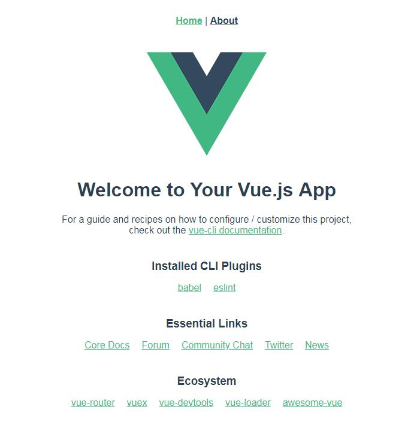

# 基本准备工作

介绍章节介绍了如何直接利用已完成的项目库克隆代码直接进行增量开发，本小节介绍了项目如何从零开始搭建及组件编写拼装。

## 1.创建项目

在任意目录

```bash
# 创建项目
vue create vue-admin
# OR vue ui 图形化界面启动
vue ui
```

创建项目默认选择核心插件 `vue-router`、`vuex` 、`sass` ,安装完成后安装 `axios` 、`vuepress`

```bash
npm install
```
:::tip
安装插件推荐使用图形界面 `vue ui`
:::

安装成功后运行
```bash
npm run serve
```

运行成功后您将看到如下页面表示运行成功


## 2.基本配置及目录创建

### es-lint

项目推荐使用es-lint语法检查工具，推荐使用webstorm打开工程因此需要配置一下es-list的检查规则

```js
  // 工程根目录 .eslintrc.js
  // 配置主要是忽略空格
  rules: {
    //...
    'indent': 'off',
    'space-before-function-paren': 'off',
    'no-unused-vars': 'off'
  }
```

### vue.config.js

由于[vue-cli3](https://cli.vuejs.org/zh/guide/)重构了项目结构，webpack的相关配置也大大简化，具体配置可参考 [cli3配置](https://cli.vuejs.org/zh/config/#vue-config-js)

本项目配置根据业务情况暂时编写为如下

```js
// 配置路径别名
var path = require('path')

function resolve (dir) {
  return path.join(__dirname, dir)
}

module.exports = {
  // 配置基础链接地址，根据发布环境添加
  publicPath: process.env.NODE_ENV === 'production'
    ? '/vue-admin-site/'
    : '/',
  // dev跨域问题
  // devServer: {
  //   proxy: {
  //     '/admin': { target: 'http://localhost:8088/cms' },
  //     '/attachment_pictures': { target: 'http://localhost:8088/cms' }
  //   }
  // },
  productionSourceMap: false,
  lintOnSave: process.env.NODE_ENV !== 'production',
  assetsDir: 'static',
  filenameHashing: true, // 发布打包文件是否有哈希后缀
  chainWebpack: config => {
    config.resolve.alias
      .set('@', resolve('src')) // key,value自行定义，比如.set('@@', resolve('src/components'))
  }
}

```

具体释义请参考配置文档

注意：配置更新需要重启服务

### 目录创建

目录创建参考介绍篇，此处不做赘述，工程搭建好后依次添加

## 3.基础工具、资源添加

目录创建完毕后，依次添加基础工具组件

### public
 
静态资源，这里复制一个富文本插件，暂时使用tinymc，后期可以添加依赖编译,在index.html文件中添加引用

```html
<script src="<%= BASE_URL %>static/tinymce/tinymce.min.js"></script>
```
详细见[富文本](./component.md#富文本) 组件解析

### api

安装`axios`后，所有ajax请求将由axios进行编写，但是实际使用时需要进行一些基础配置和封装，这里添加一个api_request.js用于封装请求相关。

[api_request.js源码](https://github.com/wangbin3162/vue-admin/tree/master/src/api/api_request.js) 

使用示例

```js
// tableExample 示例
import request from './api_request'

// 初始化树节点
export function initTreeData () {
  return request({
    url: 'https://easy-mock.com/mock/5a93b9748be1e80aa1c9293e/kingdee/table/tree',
    method: 'get'
  })
}

// 查询列表
export function getListData () {
  return request({
    url: 'https://easy-mock.com/mock/5a93b9748be1e80aa1c9293e/kingdee/table/list',
    method: 'get'
  })
}
```

### assets

公共静态资源、图片、字体库、基础样式等，复制粘贴至assets

字体库使用阿里[iconfont](https://www.iconfont.cn/),具体使用方法参考组件解析->基本资源->图标

### common

js:mixin，cache等项目相关js

cache.js为缓存，借助[good-storage](https://www.npmjs.com/package/good-storage)实现左侧菜单栏的持久化存储

```js
import storage from 'good-storage'

// 左侧菜单栏打卡状态
const SIDEBAR_KEY = '__sidebarStatus__'

export function getSidebarStatus () {
  let some = storage.get(SIDEBAR_KEY, true)
  return some
}

export function setSidebarStatus (status) {
  let some = storage.set(SIDEBAR_KEY, status)
  return some
}
```

util 文件夹内包含了三个辅助js，dom封装了dom操作的一些工具，validate则统一配置了一些常用的校验规则，这里不做多说明，utils.js则封装
了一些最常用的工具，如下：

```js
/**
 * 时间格式化
 * @param time
 * @param cFormat
 * @returns {*}
 */
export function parseTime (time, cFormat) {
  if (arguments.length === 0) {
    return null
  }
  const format = cFormat || '{y}-{m}-{d} {h}:{i}:{s}'
  let date
  if (typeof time === 'object') {
    date = time
  } else {
    if (('' + time).length === 10) time = parseInt(time) * 1000
    date = new Date(time)
  }
  const formatObj = {
    y: date.getFullYear(),
    m: date.getMonth() + 1,
    d: date.getDate(),
    h: date.getHours(),
    i: date.getMinutes(),
    s: date.getSeconds(),
    a: date.getDay()
  }
  // eslint-disable-next-line
  const time_str = format.replace(/{(y|m|d|h|i|s|a)+}/g, (result, key) => {
    let value = formatObj[key]
    if (key === 'a') return ['一', '二', '三', '四', '五', '六', '日'][value - 1]
    if (result.length > 0 && value < 10) {
      value = '0' + value
    }
    return value || 0
  })
  // eslint-disable-next-line
  return time_str
}

/**
 * 数组插入函数
 * @param arr 数组
 * @param val 插入值
 * @param compare 比较函数,传入,判断是否存在插入值
 * @param maxLen 最大插入个数,不传即为max
 */
export function insertArray (arr, val, compare, maxLen) {
  const index = arr.findIndex(compare)
  // 如果当前插入的值就在第一个位置则啥都不做
  if (index === 0) {
    return
  }
  // 如果数组中有这条数据则删除这个
  if (index > 0) {
    arr.splice(index, 1)
  }
  arr.unshift(val)// 插入数据
  if (maxLen && arr.length > maxLen) {
    arr.pop()// 如果数组超出，则把最后一个给推出
  }
}

/**
 *  删除数据
 * @param arr 数组
 * @param compare 比较函数,传入,判断是否存在插入值
 */
export function deleteFromArray (arr, compare) {
  const index = arr.findIndex(compare)
  // 如果数组中有这条数据则删除这个
  if (index > -1) {
    arr.splice(index, 1)
  }
}

/**
 * 节流函数，延迟执行函数
 * @param func 延迟的函数类型
 * @param delay 延迟毫秒数
 * @return {Function} 返回一个执行函数
 */
export function debounce (func, delay) {
  let timer
  return function (...args) {
    if (timer) {
      clearTimeout(timer)
    }
    timer = setTimeout(() => {
      func.apply(this, args)
    }, delay)
  }
}

/**
 * 洗牌函数
 * @param arr 需要洗牌的数组
 * @return {打乱次序的新数组}
 */
export function shuffle (arr) {
  let newArr = arr.slice()// 复制一个新数组
  for (let i = 0; i < newArr.length; i++) {
    let j = getRandomInt(0, i)// 在0-当前循环的位置随机一个位置做交换
    let t = newArr[i]
    newArr[i] = newArr[j]
    newArr[j] = t
  }
  return newArr
}

/**
 * 在某个区间随机一个整数
 * @param min 最小值
 * @param max 最大值
 * @return {number}
 */
export function getRandomInt (min, max) {
  return Math.floor(Math.random() * (max - min + 1) + min)
}

/**
 * 清空回车换行符
 * @param str
 * @returns {*}
 */
export function replaceReturn (str) {
  return str ? str.replace(/(↵)+|(\n)+|(\r\n)+/g, '') : ''
}

/**
 * 返回一个水印canvas
 */
export function getWaterMark (str) {
  var waterMarkText = str || 'Kingdee'

  var canvas = document.createElement('canvas')
  var ctx = canvas.getContext('2d')
  canvas.width = canvas.height = 100
  ctx.textAlign = 'center'
  ctx.textBaseline = 'middle'
  ctx.globalAlpha = 0.08
  ctx.font = '20px Microsoft Yahei'
  ctx.translate(50, 50)
  ctx.rotate(-Math.PI / 4)
  ctx.fillText(waterMarkText, 0, 0)
  return canvas
}

```

### directive

全局指令，封装了按钮点击的水波纹指令，使用v-wave指令完成功能，参考组件解析 [水波纹指令](./component.md#水波纹指令)

### components

封装组件，包含按钮组、图表、分割线、抽屉、label文本、整体布局、滚动、分隔区块、富文本、标题栏等。

实现参考组件解析 [基础组件](./component.md#components基础组件)

### plugin

自定义插件封装，用于引用全局指令，全局filter，全局函数等功能
```js
import waves from '../directive/waves'

let MyPlugin = {}
MyPlugin.install = function (Vue, options) {
  // 1. 添加全局方法或属性
  Vue.myGlobalMethod = function () {
    // 逻辑...
  }

  // 2. 添加全局资源
  Vue.directive('waves', waves)// 全局注册水波纹指令

  // 3. 添加实例方法
  /**
   * 自定义打印功能 调试模式打印
   * @param message
   */
  Vue.prototype.$cLog = function (message) {
    if (process.env.NODE_ENV !== 'production') {
      console.log(message)
    }
  }
}
export default MyPlugin

```

## 4.准备完成

到这里准备工作算是准备完成，请注意这里的基础组件部分不是从零开始，这部分是可以完全独立于后台管理项目的基础组件。与后台管理相关的
组件如MenuBar，NavBar等统一编写至views文件目录内，以便统一进行管理

下一章节将会从入口开始编写代码，一步一步实现并完成基础布局搭设、实现路由跳转、vuex全局状态管理，以及如何添加一个新的模块增删改查等功能
